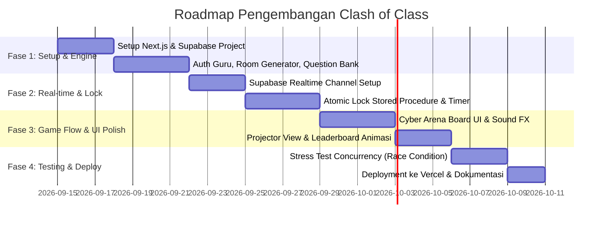

# Clash of Class — PRD, SRS, SDD & Roadmap Arsitektur

Dokumen ini berisi spesifikasi teknis dan produk lengkap untuk **Clash of Class**, platform pembelajaran interaktif berbasis kompetisi *real-time* terinspirasi dari format game show akademik (seperti *Clash of Champions* / *Jeopardy*).

---

## DAFTAR ISI
1. [PRD (Product Requirements Document) & Analisis Fitur](#1-prd-product-requirements-document)
2. [SRS (Software Requirements Specification)](#2-srs-software-requirements-specification)
3. [SDD (Software Design Document) & Arsitektur Vercel](#3-sdd-software-design-document)
4. [Desain UI/UX Flow (Bebas Template AI Generic)](#4-desain-uiux-flow)
5. [Roadmap Pengerjaan Per Fase](#5-roadmap-pengerjaan-per-fase)

---

# 1. PRD (Product Requirements Document)

### 1.1 Visi & Problem Statement
* **Latar Belakang**: Kuis konvensional (seperti Google Forms atau Kahoot standar) sering kali terasa monoton karena setiap siswa mengerjakan soal yang sama secara pasif di layar masing-masing tanpa ada dinamika perebutan soal (board claiming) secara taktis.
* **Solusi**: **Clash of Class** membawa mekanik *real-time board claiming*. Soal-soal disajikan di arena bersama. Siswa/kelompok harus cepat dan tanggap: siapa cepat dia dapat. Soal yang dibuka oleh satu siswa dikunci selama 1 menit. Jika gagal atau waktu habis, soal terbuka kembali untuk diperebutkan siswa lain.

### 1.2 Target Pengguna
1. **Guru (Host / Game Master)**:
   - Membuat paket soal (pertanyaan, bobot poin, opsi/jawaban, pembahasan, batas waktu).
   - Membuat Room permainan dan membagikan PIN / QR Code.
   - Mengatur mode: **Individu** atau **Kelompok (Team)**.
   - Mengendalikan alur kuis (Start, Pause, Force Unlock, End, Tampilkan Leaderboard).
2. **Siswa (Peserta / Kontestan)**:
   - Masuk tanpa registrasi rumit (cukup Room PIN + Nama / Pilih Kelompok).
   - Melihat papan soal (Question Board) yang berubah statusnya secara *real-time*.
   - Mengunci dan menyelesaikan soal dalam batas waktu 60 detik.
   - Melihat leaderboard dinamis secara langsung.

### 1.3 Analisis & Rekomendasi Fitur Unggulan (Feature Enhancements)

| Fitur Asli | Analisis Kebutuhan | Rekomendasi Fitur Tambahan (Saran Inovatif) |
| :--- | :--- | :--- |
| **Buka Soal & Lock 1 Menit** | Jika hanya lock 1 menit, bisa terjadi siswa sengaja klik soal hanya untuk mengulur waktu (trolling). | **Cooldown Penalty**: Jika siswa A membuka soal lalu membiarkannya sampai waktu habis (timeout) atau menjawab salah, siswa A terkena *cooldown* 20 detik tidak bisa membuka soal itu lagi. Ini memberi kesempatan bagi siswa lain untuk "mencuri" (*Steal*). |
| **Real-time WebSocket** | Vercel adalah platform Serverless (tidak support persistent socket server seperti `socket.io` di instance yang sama tanpa putus). | Gunakan **Next.js App Router + Supabase Realtime (PostgreSQL Broadcast & Presence)**. Sepenuhnya gratis, tanpa ribet server maintenance, dan kompatibel 100% dengan Vercel. |
| **Individu & Kelompok** | Di mode kelompok, jika 1 anggota buka soal, anggota lain di tim yang sama harus tersinkronisasi. | **Team Sync View**: Saat Anggota 1 mengunci soal, layar rekan satu timnya langsung menampilkan soal yang sedang dikerjakan tim mereka, dengan indikator nama siapa yang sedang mengetik/memilih jawaban. |
| **Leaderboard** | Papan nilai standar biasanya membosankan. | **Gamified Audio & Visual FX**: Sound effect saat soal berhasil direbut, sound ticker 10 detik terakhir yang menegangkan, serta badge "Streak Bonus" jika berhasil menjawab 3 soal berturut-turut. |
| **Tampilan Guru** | Guru perlu mengontrol kelas jika ada kendala jaringan atau kegaduhan. | **Host Emergency Controls**: Tombol *Reset Lock* (buka paksa soal yang nyangkut), *Kick Bad User*, dan *Projection Mode* (tampilan khusus proyektor untuk dipajang di depan kelas). |

---

# 2. SRS (Software Requirements Specification)

### 2.1 State Machine Status Soal
Setiap soal di dalam room memiliki status siklus hidup yang ketat:

```
[ AVAILABLE ] ──(Siswa Klik / Lock)──> [ LOCKED ] (Maksimal 60s)
      ^                                      │
      │ (Timeout / Salah Jawab)              │ (Jawaban Benar)
      └──────────────────────────────────────┴──────────────> [ SOLVED ] (Permanen)
```

1. **AVAILABLE (Tersedia)**:
   - Warna: Biru Neon / Putih Bersih.
   - Dapat diklik oleh peserta mana pun yang tidak sedang dalam status *cooldown*.
2. **LOCKED (Terkunci)**:
   - Warna: Kuning Amber / Oranye Terang berkedip.
   - Menampilkan avatar / nama pengunci dan *countdown timer* 60s ke semua peserta.
   - Peserta lain tidak dapat mengeklik soal ini (tombol dinonaktifkan).
   - Pengunci mendapatkan antarmuka pengerjaan soal dan tombol submit.
3. **SOLVED (Selesai/Direbut)**:
   - Warna: Hijau Emerald dengan watermark nama pemenang / skor.
   - Terkunci permanen dan tidak dapat dibuka lagi hingga akhir sesi kuis.

### 2.2 Pencegahan Race Condition (Atomic Locking)
* **Masalah**: Jika Siswa A dan Siswa B mengeklik soal nomor 5 pada milidetik yang sama, kedua siswa tidak boleh membuka soal yang sama.
* **Aturan Sistem**:
  - Penguncian soal wajib bersifat **Atomic** di level database menggunakan PostgreSQL Stored Procedure (`SELECT ... FOR UPDATE` atau conditional `UPDATE room_questions SET locked_by = user_id WHERE status = 'AVAILABLE' RETURNING *`).
  - Request yang sampai kedua milidetik berikutnya akan menerima respon gagal (`ALREADY_LOCKED`) dan otomatis mentrigger notifikasi toast di layar siswa B: *"Soal ini baru saja direbut oleh Siswa A!"*.

### 2.3 Aturan Game & Validasi
1. **Aturan 1 Peserta 1 Soal**: Seorang siswa/tim hanya diperbolehkan mengunci 1 soal pada satu waktu. Tidak bisa membuka soal nomor 1 dan nomor 2 sekaligus.
2. **Penilaian Skor**:
   - Poin dasar soal: disesuaikan dengan tingkat kesulitan (Easy: 100, Medium: 200, Hard: 300).
   - *Time Bonus (Opsional)*: Tambahan 1 poin per sisa detik saat submit benar.
   - *Salah Jawab*: Mengurangi 25 poin (atau 0 poin, sesuai konfigurasi guru) untuk mencegah tebak asal-asalan.
3. **Validasi Input**:
   - Nama Siswa: 3-25 karakter alfanumerik, filter kata terlarang (profanity filter).
   - Kode Room: 6 karakter uppercase acak (contoh: `CLAS78`).
   - Jawaban: Pilihan ganda (A/B/C/D/E) atau isian singkat *case-insensitive*.

---

# 3. SDD (Software Design Document)

### 3.1 Arsitektur Sistem (Vercel + Supabase Stack)
Karena proyek ingin **mudah dihosting di Vercel**, arsitektur menggunakan pendekatan modern serverless:

```
┌─────────────────────────────────────────────────────────────┐
│                    VERCEL DEPLOYMENT                        │
│                                                             │
│   Next.js 14/15 (App Router - TypeScript)                   │
│   ├── Client UI (React + Tailwind CSS + Lucide Icons)       │
│   ├── Audio Engine (Howler.js / Web Audio API)              │
│   └── Server Actions / Route Handlers (API Logic)           │
└──────────────┬───────────────────────────────▲──────────────┘
               │                               │
       (Postgres REST / RPC)            (WebSockets Channel)
               │                               │
┌──────────────▼───────────────────────────────┴──────────────┐
│                    SUPABASE (Free Tier)                     │
│                                                             │
│   ├── PostgreSQL Database (Data & Atomic Locks)             │
│   ├── Supabase Realtime (Presence & Broadcast Engine)       │
│   │   ├── channel("room:{code}")                            │
│   │   ├── event: "QUESTION_LOCKED"                          │
│   │   ├── event: "QUESTION_RELEASED"                        │
│   │   ├── event: "QUESTION_SOLVED"                          │
│   │   └── event: "LEADERBOARD_UPDATED"                      │
│   └── Database Triggers / Stored Procedures (Lock Engine)   │
└─────────────────────────────────────────────────────────────┘
```

> **Keuntungan Utama**:
> 1. **Zero Server Maintenance**: Tidak perlu menyewa VPS Linux atau setup Nginx/Redis.
> 2. **Auto Scale**: Mampu menangani 30-100 siswa per kelas tanpa kendala latency.
> 3. **Real-time Bawaan**: Supabase Realtime menggunakan Elixir Phoenix channels di balik layar yang sangat efisien untuk koneksi WebSocket ratusan pengguna simultan.

---

### 3.2 Desain Basis Data (PostgreSQL Schema)

```sql
-- 1. Tabel Rooms (Sesi Permainan)
CREATE TABLE rooms (
    id UUID PRIMARY KEY DEFAULT gen_random_uuid(),
    code VARCHAR(6) UNIQUE NOT NULL,
    teacher_name VARCHAR(100) NOT NULL,
    title VARCHAR(150) NOT NULL,
    mode VARCHAR(20) DEFAULT 'INDIVIDUAL', -- 'INDIVIDUAL' | 'TEAM'
    status VARCHAR(20) DEFAULT 'WAITING',   -- 'WAITING' | 'ACTIVE' | 'FINISHED'
    created_at TIMESTAMP WITH TIME ZONE DEFAULT NOW()
);

-- 2. Tabel Teams (Opsional jika Mode Kelompok)
CREATE TABLE teams (
    id UUID PRIMARY KEY DEFAULT gen_random_uuid(),
    room_id UUID REFERENCES rooms(id) ON DELETE CASCADE,
    team_name VARCHAR(50) NOT NULL,
    total_score INT DEFAULT 0
);

-- 3. Tabel Participants (Siswa)
CREATE TABLE participants (
    id UUID PRIMARY KEY DEFAULT gen_random_uuid(),
    room_id UUID REFERENCES rooms(id) ON DELETE CASCADE,
    team_id UUID REFERENCES teams(id) ON DELETE SET NULL,
    name VARCHAR(100) NOT NULL,
    score INT DEFAULT 0,
    is_active BOOLEAN DEFAULT TRUE,
    joined_at TIMESTAMP WITH TIME ZONE DEFAULT NOW()
);

-- 4. Tabel Questions Bank (Soal)
CREATE TABLE questions (
    id UUID PRIMARY KEY DEFAULT gen_random_uuid(),
    room_id UUID REFERENCES rooms(id) ON DELETE CASCADE,
    question_text TEXT NOT NULL,
    options JSONB NOT NULL, -- [{"label": "A", "text": "..."}, ...]
    correct_answer VARCHAR(10) NOT NULL,
    points INT DEFAULT 100,
    order_index INT NOT NULL
);

-- 5. Tabel Room Questions (Status Dinamis Soal di Arena)
CREATE TABLE room_questions (
    id UUID PRIMARY KEY DEFAULT gen_random_uuid(),
    room_id UUID REFERENCES rooms(id) ON DELETE CASCADE,
    question_id UUID REFERENCES questions(id) ON DELETE CASCADE,
    status VARCHAR(20) DEFAULT 'AVAILABLE', -- 'AVAILABLE' | 'LOCKED' | 'SOLVED'
    locked_by_participant_id UUID REFERENCES participants(id),
    locked_by_team_id UUID REFERENCES teams(id),
    locked_at TIMESTAMP WITH TIME ZONE,
    lock_expires_at TIMESTAMP WITH TIME ZONE,
    solved_by_name VARCHAR(100)
);

-- 6. Atomic Stored Procedure untuk Mengunci Soal (Anti-Race Condition)
CREATE OR REPLACE FUNCTION claim_question_lock(
    p_room_question_id UUID,
    p_participant_id UUID,
    p_team_id UUID,
    p_lock_duration_seconds INT DEFAULT 60
) RETURNS BOOLEAN AS $$
DECLARE
    v_updated INT;
BEGIN
    UPDATE room_questions
    SET status = 'LOCKED',
        locked_by_participant_id = p_participant_id,
        locked_by_team_id = p_team_id,
        locked_at = NOW(),
        lock_expires_at = NOW() + (p_lock_duration_seconds || ' seconds')::INTERVAL
    WHERE id = p_room_question_id 
      AND (
          status = 'AVAILABLE' 
          OR (status = 'LOCKED' AND lock_expires_at < NOW()) -- Auto hijack jika sudah expired
      );

    GET DIAGNOSTICS v_updated = ROW_COUNT;
    RETURN v_updated > 0;
END;
$$ LANGUAGE plpgsql;
```

---

### 3.3 Struktur Real-time Event (WebSocket Payload)

1. **Event `QUESTION_LOCKED`**:
   ```json
   {
     "event": "QUESTION_LOCKED",
     "payload": {
       "questionId": "rq-102",
       "lockedBy": "Kelompok Garuda",
       "participantName": "Budi Pratama",
       "expiresAt": "2026-09-13T12:35:00Z",
       "durationSeconds": 60
     }
   }
   ```
2. **Event `QUESTION_RELEASED` (Timeout / Salah Jawab)**:
   ```json
   {
     "event": "QUESTION_RELEASED",
     "payload": {
       "questionId": "rq-102",
       "reason": "TIMEOUT",
       "message": "Waktu pengerjaan habis! Soal kembali terbuka."
     }
   }
   ```
3. **Event `QUESTION_SOLVED`**:
   ```json
   {
     "event": "QUESTION_SOLVED",
     "payload": {
       "questionId": "rq-102",
       "solvedBy": "Kelompok Garuda",
       "pointsAwarded": 200,
       "newLeaderboard": [
         { "rank": 1, "name": "Kelompok Garuda", "score": 450 },
         { "rank": 2, "name": "Kelompok Rajawali", "score": 300 }
       ]
     }
   }
   ```

---

# 4. Desain UI/UX Flow

Agar tidak berpenampilan seperti template SaaS biasa atau form kuis generik, **Clash of Class** mengusung tema **"Cyber Game Arena"**:
* **Visual Palette**: Background Dark Slate (`#0B0F19`) dipadukan dengan aksen Neon Amber (`#F59E0B`), Electric Cyan (`#06B6D4`), dan Ruby Crimson (`#EF4444`).
* **Tipografi**: Font modern & tegas (*Plus Jakarta Sans* untuk UI, *Chakra Petch* atau font monospaced untuk angka skor dan countdown timer).
* **Feedback Audio (Web Audio Synth)**:
  - *Click*: Sound switch mekanikal ringan.
  - *Locked*: Sound buzzer arcade khas.
  - *Correct*: Fanfare kemenangan singkat.
  - *Tick-Tock*: Detak jantung 10 detik terakhir saat mengunci soal.

### 4.1 Flow Layar Siswa (Player Flow)
1. **Layar Masuk (Lobby Join)**:
   - Input PIN 6-digit (dengan auto-uppercase dan auto-focus).
   - Input Nama Lengkap / Panggilan.
   - Pilihan Kelompok (jika mode Room adalah Team).
   - Tombol "Masuk ke Arena" dengan efek glow pulsing.
2. **Layar Arena (The Battle Board)**:
   - Header: Skor Pribadi/Tim, Sisa Soal Terbuka, Status Koneksi Real-time (indikator hijau).
   - Body Utama: **Grid Kartu Soal (Matriks Soal)**.
     - Tiap kartu menunjukkan nomor soal dan bobot poin (misal: `#01 - 100 PTS`).
     - Jika soal sedang dikerjakan orang lain: Kartu berubah jadi warna oranye amber berkedip dengan nama pengunci & countdown bar yang menyusut.
     - Jika soal sudah dijawab: Kartu berubah jadi hijau gelap dengan label `SOLVED`.
3. **Modal / Workspace Pengerjaan Soal (Hanya untuk Pengunci)**:
   - Timer 60 detik melingkar (*Radial Circular Timer*) di bagian atas.
   - Teks Soal yang jelas & kontras tinggi.
   - Pilihan ganda dengan tombol interaktif besar (cocok untuk touchscreen HP maupun desktop).
   - Tombol "KIRIM JAWABAN SEKARANG".

### 4.2 Flow Layar Guru & Mode Proyektor (Projector View)
* Guru memiliki tombol **"Tampilan Layar Depan / Projector Mode"** untuk ditampilkan di TV kelas/proyektor.
* Di proyektor: Papan soal raksasa, *Live Activity Feed* (contoh: *"Budi baru saja mengunci Soal #4!"*), dan *Dynamic Live Podiums* (3 peringkat teratas dengan animasi naik turun).

---

# 5. Roadmap Pengerjaan Per Fase

Rencana kerja dibagi ke dalam 4 fase terstruktur yang realistis dan dapat dikerjakan secara bertahap:



### Rincian Tiap Fase:

#### **Fase 1: Setup Project & Core CRUD (Hari 1 - 7)**
- Inisialisasi Next.js (TypeScript, Tailwind CSS, Lucide React).
- Setup Supabase Database (eksekusi script DDL schema di atas).
- Modul Guru: Form pembuatan room, input paket soal (tambah/edit/hapus), set bobot poin.
- Modul Siswa: Halaman join room via kode PIN dan pembuatan sesi lokal (LocalStorage session token).

#### **Fase 2: Real-time Concurrency & Lock Engine (Hari 8 - 14)**
- Integrasi Supabase Realtime Broadcast & Presence.
- Implementasi PostgreSQL RPC `claim_question_lock` untuk mencegah 2 siswa mengunci soal yang sama pada milidetik yang sama.
- Mekanisme timer 60 detik (sinkronisasi jam server melalui timestamp `lock_expires_at`).
- Mekanisme auto-release jika waktu habis (bisa ditrigger oleh database expiry check atau client heartbeat).

#### **Fase 3: Game Mechanics, UI Styling & Sound System (Hari 15 - 21)**
- Implementasi desain "Cyber Game Arena" (Grid Soal responsif, transisi warna status soal).
- Integrasi efek suara (Web Audio API) untuk event *lock*, *countdown alert*, dan *point scored*.
- Pembuatan halaman khusus **Projector Mode** untuk guru (tampilan layar depan kelas tanpa tombol submit).
- Leaderboard dinamis dengan animasi pergeseran ranking.

#### **Fase 4: Testing, Anti-Troll Polish & Vercel Deployment (Hari 22 - 26)**
- Simulasi pengujian konkuren: 30 tab browser membuka soal bersamaan untuk memastikan atomic lock bekerja 100%.
- Penambahan filter anti-spam (cooldown penalty untuk peserta yang membiarkan soal timeout).
- Deployment ke Vercel (koneksi Environment Variables Supabase).
- Final User Acceptance Testing (UAT) di lingkungan kelas nyata.
